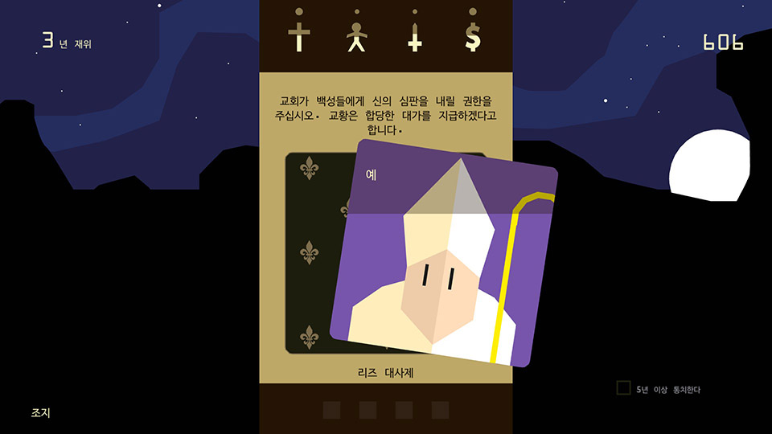

# namushoe.github.io

[1.컨셉](#컨셉)  
[2.관련 이미지 & 동영상](#관련-이미지--동영상)  
[3.대표 이미지](#대표-이미지)  
[4.컨셉 & 대표이미지 기반 작품묘사](#컨셉--대표이미지-기반-작품묘사)  
[5.게임제목 구성 요소](#게임제목-구성-요소)  
[6.게임 시스템 디자인](#게임-시스템-디자인)  
[7.개발 요구사항 & 흐름도](#개발-요구사항--흐름도)

# 프로젝트명: I'm human

-시뮬레이션 게임

# [컨셉]

## 메인컨셉 : 선택

- 게임 플레이에 메인 컨셉으로 플레이어에게 선택지가 제공됩니다.
- 플레이어에게 최소 3가지 선택지가 주어집니다.

### 서브 컨셉 1 : 호칭 변환

- 플레이어의 선택에 따라 주변 npc들에게 생각되는 호칭으로 변화됩니다.
- 호칭은 랜덤 이벤트 또는 선택에 따라 나중에 게임에 진행이 바뀝니다.

### 서브 컨셉 2 : 카르마 시스템

- 선행을 할 시 평가가 좋아지며 악행을 할 시 평가가 나빠집니다.
- 플레이어의 선택에 따른 이벤트의 결과가 바뀝니다.
- 선택에 따른 이득도 있지만 손해도 생깁니다.

### 서브 컨셉 3 : 전지적 시점

- 신의 시점으로 npc가 유저에게 질문 합니다.
- 유저의 선택으로 나온 상황을 전체적으로 바라볼수 있습니다.

### 서브 컨셉 4 : 사운드

- 사운드 기본 베이스로 평화로운 사운드가 나옵니다.
- 플레이어의 선택에 따라 게임 속 분위기를 나타내는 방법 중 하나가 됩니다.
  (어두운 분위기로 갈 수록 어둔운 노래가 밝은 분위기로 갈 수록 밝은 노래가 나옵니다.)
- 비슷한 이미지와 텍스트로 다조로운 느낌을 현재 나오는 사운드로 상황이 바뀌는것을 나타냅니다.

### 서브 컨셉 5 : AI, 인공지능

- 다양한 상황을 연출하기 위해 새로운 이벤트가 플레이어에게 나타납니다.
- 플레이어의 선택에 따라 그 이후 나올 npc 태도와 이벤트가 랜덤으로 생성됩니다.

  

# [관련 이미지 & 동영상]

- 이미지
  
- 동영상
  <iframe width="720" height="480" src="https://www.youtube.com/embed/O2HnvpXqII4" title="YouTube video player" frameborder="0" allow="accelerometer; autoplay; clipboard-write; encrypted-media; gyroscope; picture-in-picture" allowfullscreen></iframe>

  

# [대표 이미지]

  

# [컨셉 & 대표이미지 기반 작품묘사]

### 대표이미지 기반 : 플레이어에게 선택이 주어지고 선택에 따라 플레이 스타일의 다양성을 추구한다.

  

# [<게임제목> 구성 요소]

- "I'm human"

 

## 1. 메커니즘

[도전 과제]

1. 플레이어의 신앙을 모든 판에 퍼트려서 승리하라
2. 플레이어의 신앙심이 0%가 되거나 적대 세력에게 모든 땅을 배았기면 패배한다.
3. 자신만의 플레이 방법으로 게임에서 승리하라.

[재미 요소]

1. 초반 플레이에 얼마 없는 자신의 신앙심을 더 증가시켜 더 많은 땅을 차지하며 성장 할 수 있다.
2. 플레이어가 직접 선택하여 자신의 신을 다양한 방향으로 바꿀 수 있다.
3. 다양한 미션을 자신의 선택에 따라 보상을 받거나 혹은 거절 하고 둘다 아닐 경우 무시 할 수 있다.

 

## 2. 이야기

[스토리]
지금 막 신이 된 당신은 아직 자신의 신도가 적고 땅도 적습니다. 게임을 진행하면서 당신의 세력을 늘리고 다양한 플레이 스타일로 게임을 진행해보세요.

[카메라 관점]
전지적 시점, 탑뷰

 

## 3. 미적요소

[디자인][컬러]
● 메인 디자인 : '문명' 게임처럼 땅을 차지 하는 것을 표현하여 땅의 색깔을 다양하게 표시

● 선택 디자인 :npc 이미지와 하단에 npc의 질문, 승낙, 거절, 무시가 있다.

[음향]
● 메인 음향 : 게임 진행 시 각자 다른 상황에 따라 긴장되는 음악 또는 편안한 음악 등을 표시한다.

● 인게임 효과음 : 선택 시 클릭 음과 전쟁 및 포교시 음향을 표시한다.
 

# [게임 시스템 디자인]

## 1. 게임 오브젝트 분해

| 연번 | 오브젝트 이름 |               오브젝트 이미지                |
| :--: | :-----------: | :------------------------------------------: |
|  1   |     평판      |      |
|  2   |      NPC      |    |
|  3   |    퀘스트     |  |

  

## 2.파라미터 뽑아보기

 

### 1) 오브젝트 이름 : 평판

 

| 속성 | 영문명칭 |       설명        | 비고 |
| :--: | :------: | :---------------: | :--: |
| 정신 |  mental  | 최대 100, 기본 50 |      |
| 체력 |  health  | 최대 100, 기본 50 |      |
|  돈  |  money   | 최대 100, 기본 50 |      |
| 식량 |   food   | 최대 100, 기본 50 |      |

  

### 2) 오브젝트 이름 : NPC

 

|  속성  | 영문명칭  |                 설명                  |  비고  |
| :----: | :-------: | :-----------------------------------: | :----: |
| 이미지 |    img    |             NPC의 이미지              |        |
|  질문  |   quest   |       NPC가 유저에게 하는 질문        |  enum  |
|  직업  |   class   |               질문 유형               |        |
|  위치  |   \_pos   |              마우스 위치              | vector |
|  상태  | condition | 앞으로 나올 질문에 영향을 줄 파라미터 |        |

  

### 3) 오브젝트 이름 : 퀘스트

 

|  속성  | 영문명칭 |   설명    | 비고 |
| :----: | :------: | :-------: | :--: |
| 텍스트 |  \_text  | 질문 출력 |      |

  

### 1) 오브젝트 이름 : 평판

 

| 행동 |      설명       |
| :--: | :-------------: |
| 상승 | 수치가 올라간다 |
| 하락 | 수치가 내려간다 |

  

### 2) 오브젝트 이름 : NPC

 

|     행동      | 설명 |
| :-----------: | :--: |
|  마우스 왼쪽  | 긍정 |
|  마우스 위쪽  | 무시 |
| 마우스 오른쪽 | 부정 |

### 3) 오브젝트 이름 : 퀘스트

 

|    행동     |       설명        |
| :---------: | :---------------: |
| 퀘스트 출력 | 퀘스트를 출력한다 |

  

## 5.플레이어 캐릭터 속성

 

|    속성     |  속성 값  |                설명                 |  비고  |
| :---------: | :-------: | :---------------------------------: | :----: |
|   마우스    |  postion  | 마우스 위치를 알기 위해 필요한 속성 | vector |
| 마우스 클릭 | mouseDown |       마우스 클릭을 감지한다        |        |

  

## 6.게임의 규칙

 

# [개발 요구사항 & 흐름도]

## 01 요구사항

### 게임의 요구사항

### 6주차

1. 메인 화면, 인 게임 화면, 엔딩 화면2가지 총 4가지
2. 메인 화면 : 게임 스타트, 게임 종료 버튼 세로로 나열되어있음
3. 메인 화면 게임 스타트를 누르면 인 게임 화면으로 전환됨
4. 메인 화면 게임 종료 버튼을 누르면 게임이 종료됨
5. 인 게임 화면 진입 후 좌측 상단에는 ○○번째 선택이 나타남
6. 중앙 상단에는 ♠ : 정신 ♥ : 체력 ◆ : 돈 ♣ : 식량 문양 표시됨
7. 문양 바로 하단에 텍스트 박스가 형성되어 안에 텍스트를 표시함
8. 화면 중앙에 이미지 카드가 생성됨
9. 이미지 카드는 좌측, 우측, 위로 카드가 드레그 시 움직이는 모션이 나옴
10. 선택지에 따라 4가지 문양의 수치가 줄어들거나 늘어남
11. 늘어나는 수치는 최대가 100 최소가 0이고 이벤트에 따라 최대 20에서 최소 5까지 수치가 조정됨
12. 게임 엔딩에는 2가지로 생존 엔딩과, 캐릭터의 사망 엔딩으로 나뉜다.
13. 20번째 턴을 버티면 생존 엔딩이 나온다.
14. 문양 수치가 0이 되거나 사망 이벤트를 볼 경우 사망 엔딩이 나온다.
15. 엔딩 화면 나온 후 화면을 마우스로 클릭 하면 메인 화면으로 돌아온다.

### 1년차

1. 캐릭터 카드 추가 및 등장 인물 추가
2. 캐릭터 카드 이동 시 효과음 추가
3. 게임 분위기에 따른 음향 변화
4. 질문 문항 최대 30문항까지 추가
5. 캐릭터 선택이 선행 또는 악행에 따라 주변 npc 반응 변화
6. 게임 결과 창에 유저가 선택한 사항 나열
7. 4가지 스텟 문양 각 문양에 맞는 모양으로 추가
8. 생존과 사망 엔딩과 각 문양 수치가 0이 됬을 때 엔딩 추가
9. 카드 이동 애니메이션 추가
