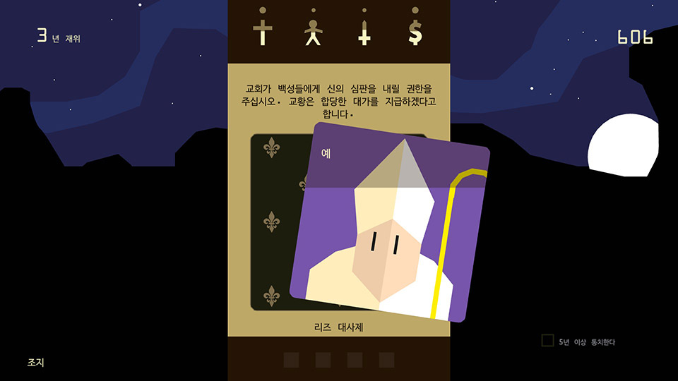

# namushoe.github.io

# 프로젝트명: I'm God
-시뮬레이션 게임

# [컨셉]

## 메인컨셉 : 선택

- 게임 플레이에 메인 컨셉으로 플레이어에게 선택지가 제공됩니다.
- 플레이어에게 최소 3가지 선택지가 주어집니다.

### 서브 컨세 1 : 호칭 변환

- 플레이어의 선택에 따라 주변 npc들에게 생각되는 호칭으로 변화됩니다.
- 호칭은 랜덤 이벤트 또는 선택에 따라 나중에 게임에 진행이 바뀝니다.

### 서브 컨세 2 : 카르마 시스템

- 선행을 할 시 평가가 좋아지며 악행을 할 시 평가가 나빠집니다.
- 플레이어의 선택에 따른 이벤트의 결과가 바뀝니다.
- 선택에 따른 이득도 있지만 손해도 생깁니다.

### 서브 컨세 3 : 전지적 시점

- 신의 시점으로 npc가 유저에게 질문 합니다.
- 유저의 선택으로 나온 상황을 전체적으로 바라볼수 있습니다.

### 서브 컨세 4 : 사운드

- 사운드 기본 베이스로 평화로운 사운드가 나옵니다.
- 플레이어의 선택에 따라 게임 속 분위기를 나타내는 방법 중 하나가 됩니다.
  (어두운 분위기로 갈 수록 어둔운 노래가 밝은 분위기로 갈 수록 밝은 노래가 나옵니다.)
- 비슷한 이미지와 텍스트로 다조로운 느낌을 현재 나오는 사운드로 상황이 바뀌는것을 나타냅니다.

### 서브 컨세 5 : AI, 인공지능

- 다양한 상황을 연출하기 위해 새로운 이벤트가 플레이어에게 나타납니다.
- 플레이어의 선택에 따라 그 이후 나올 npc 태도와 이벤트가 랜덤으로 생성됩니다.

  

# [관련 이미지 & 동영상]

- 이미지
  
- 동영상
  

  

# [대표 이미지]

  

# [컨셉 & 대표이미지 기반 작품묘사]

### 대표이미지 기반 : 플레이어에게 선택이 주어지고 선택에 따라 플레이 스타일의 다양성을 추구한다.

  

# [<게임제목> 구성 요소]

- "I'm god"

 

## 1. 메커니즘

[도전 과제]

1. 플레이어의 신앙을 모든 판에 퍼트려서 승리하라
2. 플레이어의 신앙심이 0%가 되거나 적대 세력에게 모든 땅을 배았기면 패배한다.
3. 자신만의 플레이 방법으로 게임에서 승리하라.

[재미 요소]

1. 초반 플레이에 얼마 없는 자신의 신앙심을 더 증가시켜 더 많은 땅을 차지하며 성장 할 수 있다.
2. 플레이어가 직접 선택하여 자신의 신을 다양한 방향으로 바꿀 수 있다.
3. 다양한 미션을 자신의 선택에 따라 보상을 받거나 혹은 거절 하고 둘다 아닐 경우 무시 할 수 있다.

 

## 2. 이야기

[스토리]
지금 막 신이 된 당신은 아직 자신의 신도가 적고 땅도 적습니다. 게임을 진행하면서 당신의 세력을 늘리고 다양한 플레이 스타일로 게임을 진행해보세요.

[카메라 관점]
전지적 시점, 탑뷰

 

## 3. 미적요소

[디자인][컬러]
● 메인 디자인 : '문명' 게임처럼 땅을 차지 하는 것을 표현하여 땅의 색깔을 다양하게 표시

● 선택 디자인 :npc 이미지와 하단에 npc의 질문, 승낙, 거절, 무시가 있다.

[음향]
● 메인 음향 : 게임 진행 시 각자 다른 상황에 따라 긴장되는 음악 또는 편안한 음악 등을 표시한다.

● 인게임 효과음 : 선택 시 클릭 음과 전쟁 및 포교시 음향을 표시한다.
 

## 4. 기술
