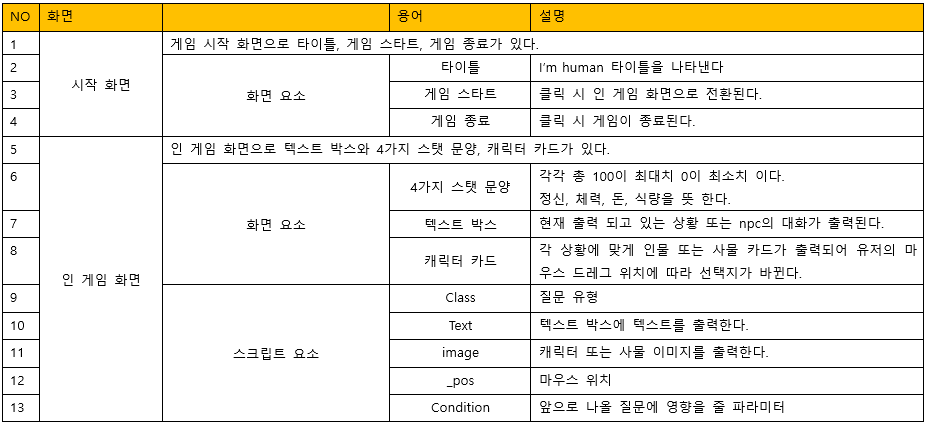
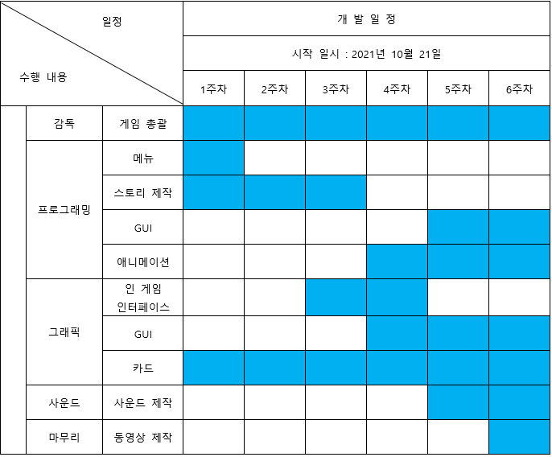

[1.컨셉](#컨셉)  
[2.관련 이미지 & 동영상](#관련-이미지--동영상)  
[3.대표 이미지](#대표-이미지)  
[4.컨셉 & 대표이미지 기반 작품묘사](#컨셉--대표이미지-기반-작품묘사)  
[5.게임제목 구성 요소](#게임제목-구성-요소)  
[6.게임 시스템 디자인](#게임-시스템-디자인)  
[7.개발 요구사항 & 흐름도](#개발-요구사항--흐름도)

# 프로젝트명: I'm human

-시뮬레이션 게임

# [컨셉]

## 메인컨셉 : 선택

- 게임 플레이에 메인 컨셉으로 플레이어에게 선택지가 제공됩니다.
- 플레이어에게 최소 2가지 선택지가 주어집니다.

### 서브 컨셉 1 : 카드

- 메인 스토리는 카드 하나로 진행됩니다.
- 간단한 카드로 진행되지만 선택 하나하나에 캐릭터의 생사가 결정됩니다.

### 서브 컨셉 2 : 4가지 수치

- 4가지 수치가 하나라도 0이되면 게임 오버 됩니다.
- 선택지에 따라 4가지 수치가 변경됩니다.

### 서브 컨셉 3 : 간단한 UI

- 인 게임 화면에 텍스트와 카드만으로 게임이 진행됩니다.

  

# [관련 이미지 & 동영상]

- 이미지
  

- 동영상

  <iframe width="720" height="480" src="https://www.youtube.com/embed/O2HnvpXqII4" title="YouTube video player" frameborder="0" allow="accelerometer; autoplay; clipboard-write; encrypted-media; gyroscope; picture-in-picture" allowfullscreen></iframe>

  

# [대표 이미지]

  

# [컨셉 & 대표이미지 기반 작품묘사]

### 대표이미지 기반 : 플레이어에게 선택이 주어지고 선택에 따라 플레이 스타일의 다양성을 추구한다.

  

# [<게임제목> 구성 요소]

- "I'm human"

 

## 1. 메커니즘

[도전 과제]

1. 플레이어는 캐릭터를 생존시켜 엔딩을 마주하시면 됩니다.
2. 플레이어 캐릭터가 4가지 수치중 하나라도 0이되면 각자 다른 엔딩이 나옵니다.
3. 다양한 선택으로 캐릭터의 캐릭터성을 완성시켜 보세요.

[재미 요소]

1. 절박한 상황 속에서 플레이어의 선택에 따라 누군가 죽거나 살 수도 있습니다.
2. 플레이어의 선택으로 주어지는 보상이 달라집니다.
3. 간단한 마우스 조작만으로 좀비 사태의 생존자가 되어 캐릭터를 엔딩까지 인도하세요.

 

## 2. 이야기

[스토리]
좀비 아포칼립스 세계에서 당신은 혼자서 생존하고 있으며, 고층 빌딩에 갇혀 다양한 생존자를 만나 물자를 교환 하거나 거래를 합니다. 하지만 선한 생존자가 있는 반면 약탈자도 있으며
당신의 선택에 따라 당신도 선한 생존자 또는 악한 생존자가 될 수 있습니다. 최대한 좀비와 약탈자에게서 생존하세요.

[카메라 관점]
1인칭 시점

 

## 3. 미적요소

[디자인][컬러]
● 메인 디자인 : 메인 화면 상단에 스텟 4가지 문양이 출력되고 바로 하단에 텍스트 박스에서 '질문'텍스트가 출력되며 가운데 카드가 생성되어 마우스 포인트 위치에 따라 카드가 따라갑니다

[음향]
● 메인 음향 : 게임 플레이에 긴장감을 주기 위해 공포스러운 음악이 재생됩니다.

 

# [게임 시스템 디자인]

## 1. 게임 오브젝트 분해

| 연번 | 오브젝트 이름 | 오브젝트 이미지 |
| :--: | :-----------: | :-------------: |
|  1   |     평판      |                 |
|  2   |      NPC      |                 |
|  3   |    퀘스트     |                 |

  

## 2.파라미터 뽑아보기

 

### 1) 오브젝트 이름 : 평판

 

| 속성 | 영문명칭 |       설명        | 비고 |
| :--: | :------: | :---------------: | :--: |
| 정신 |  mental  | 최대 100, 기본 50 |      |
| 체력 |  health  | 최대 100, 기본 50 |      |
|  무기  |  weapon   | 최대 100, 기본 50 |      |
| 식량 |   food   | 최대 100, 기본 50 |      |

  

### 2) 오브젝트 이름 : NPC

 

|  속성  | 영문명칭  |                 설명                  | 비고 |
| :----: | :-------: | :-----------------------------------: | :--: |
| 이미지 |    img    |             NPC의 이미지              |      |
|  질문  |   quest   |       NPC가 유저에게 하는 질문        |      |
|  직업  |   class   |               질문 유형               |      |
|  위치  |   \_pos   |              마우스 위치              |      |
|  상태  | condition | 앞으로 나올 질문에 영향을 줄 파라미터 |      |

  

### 3) 오브젝트 이름 : 퀘스트

 

|  속성  | 영문명칭 |   설명    | 비고 |
| :----: | :------: | :-------: | :--: |
| 텍스트 |  \_text  | 질문 출력 |      |

  

### 1) 오브젝트 이름 : 평판

 

| 행동 |      설명       |
| :--: | :-------------: |
| 상승 | 수치가 올라간다 |
| 하락 | 수치가 내려간다 |

  

### 2) 오브젝트 이름 : NPC

 

|     행동      | 설명 |
| :-----------: | :--: |
|  마우스 왼쪽  | 긍정 |
| 마우스 오른쪽 | 부정 |

### 3) 오브젝트 이름 : 퀘스트

 

|    행동     |       설명        |
| :---------: | :---------------: |
| 퀘스트 출력 | 퀘스트를 출력한다 |

  

## 5.플레이어 캐릭터 속성

 

|    속성     |  속성 값  |                설명                 | 비고 |
| :---------: | :-------: | :---------------------------------: | :--: |
|   마우스    |  postion  | 마우스 위치를 알기 위해 필요한 속성 |      |
| 마우스 클릭 | mouseDown |       마우스 클릭을 감지한다        |      |

  

## 6.게임의 규칙

마우스만으로 조작 하며 게임 화면 상단에 텍스트가 출력 되고 중앙에 카드가 생성됩니다. 카드는 플레이어 마우스 포인트를 따라가며 좌,우 방향으로 움직입니다.
카드는 움직이는 방향에 따라 답변이 바뀌며 플레이어는 그 답변을 보고 원하는 플레이 방향으로 카드를 선택하면 됩니다.
플레이어에게 4가지 (체력, 무기, 식량, 정신력)이 있으며 이 수치들을 조절하고 랜덤으로 나오는 이벤트를 선택하여 캐릭터를 끝까지 생존시키면 됩니다.

 

# [개발 요구사항 & 흐름도]

## 01 요구사항

### 게임의 요구사항

### 6주차

[그래픽]

1. ~~메인 화면, 인 게임 화면, 엔딩 화면~~
2. ~~메인 화면 : 게임 스타트, 게임 종료 버튼 세로로 나열되어있음~~
3. ~~메인 화면 : 게임 스타트, 게임 종료 인터페이스 설정~~
4. ~~중앙 상단에는 ♠ : 정신 ♥ : 체력 ◆ : 돈 ♣ : 식량 문양 표시됨~~
5. ~~이미지 카드는 좌측, 우측, 위로 카드가 드레그 시 움직이는 모션이 나옴~~

[프로그래밍]

1. ~~메인 화면 게임 스타트를 누르면 인 게임 화면으로 전환됨~~
2. ~~메인 화면 게임 종료 버튼을 누르면 게임이 종료됨~~
3. ~~인 게임 화면 진입 후 좌측 상단에는 ○○번째 선택이 나타남~~
4. ~~화면 중앙에 이미지 카드가 생성됨~~
5. ~~문양 바로 하단에 텍스트 박스가 형성되어 안에 텍스트를 표시함~~
6. ~~문양 늘어나는 수치는 최대가 100 최소가 0이고 이벤트에 따라 최대 20에서 최소 5까지 수치가 조정됨~~
7. ~~선택지에 따라 4가지 문양의 수치가 줄어들거나 늘어남~~

### 1년차

1. 캐릭터 카드 이미지 추가
2. 캐릭터 카드 이동 시 효과음 추가
3. 게임 분위기 맞는 음향 추가
4. 질문 문항 최대 30문항까지 추가
5. 4가지 스텟 문양 각 문양에 맞는 모양으로 추가
6. 생존과 사망 엔딩과 각 문양 수치가 0이 됬을 때 엔딩 추가

## 02 용어정리

## 03 게임작업일정

 

# [구현]

## 1주차

<video width = "100%" height = "100%" controls="controls">
  <source src = "./video/1주차.mp4" type = "video/mp4">
</video>

 

## 2주차

<video width = "100%" height = "100%" controls="controls">
  <source src = "./video/2주차.mp4" type = "video/mp4">
</video>

 

## 3주차

<video width = "100%" height = "100%" controls="controls">
  <source src = "./video/3주차.mp4" type = "video/mp4">
</video>

 

## 4주차

<video width = "100%" height = "100%" controls="controls">
  <source src = "./video/4주차.mp4" type = "video/mp4">
</video>

 

## 5주차

<video width = "100%" height = "100%" controls="controls">
  <source src = "./video/5주차.mp4" type = "video/mp4">
</video>

 

## 6주차

<video width = "100%" height = "100%" controls="controls">
  <source src = "./video/6주차.mp4" type = "video/mp4">
</video>
